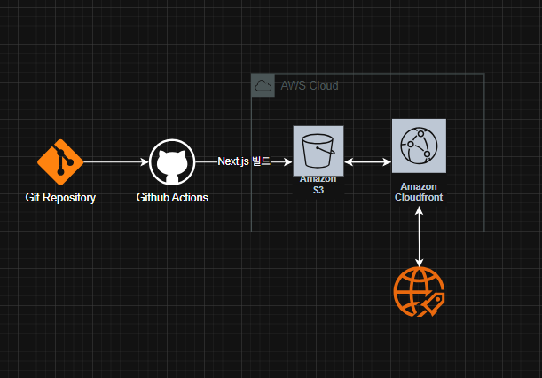
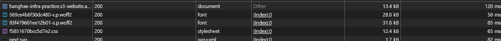
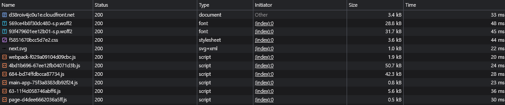
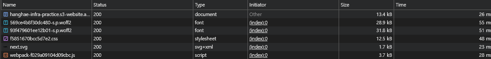
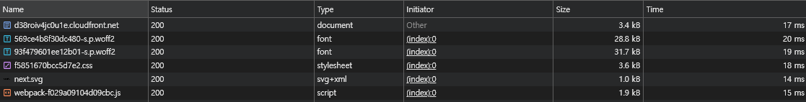
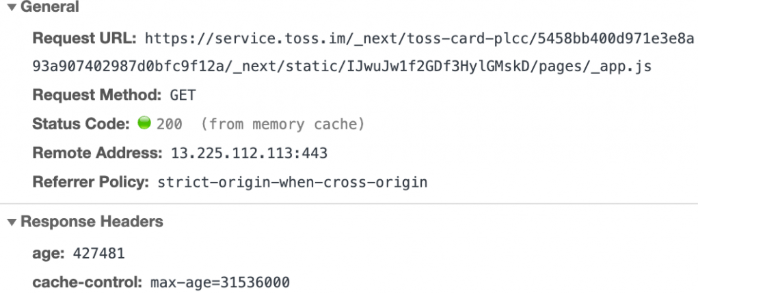
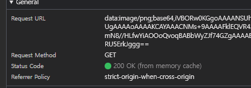
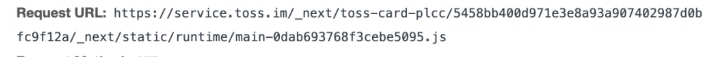

# 목차
- [목차](#목차)
- [프론트엔드 배포 파이프라인](#프론트엔드-배포-파이프라인)
- [주요 링크](#주요-링크)
  - [](#)
- [워크플로우 프로세스](#워크플로우-프로세스)
  - [on 섹션](#on-섹션)
  - [jobs - deploy](#jobs---deploy)
- [CDN과 성능최적화](#cdn과-성능최적화)
    - [AS-IS: s3를 통한 정적 파일 배포](#as-is-s3를-통한-정적-파일-배포)
    - [TO-BE: cloudFront(CDN) 적용 후](#to-be-cloudfrontcdn-적용-후)
    - [비교분석](#비교분석)
- [브라우저의 캐시](#브라우저의-캐시)
  - [chat gpt가 정리한 내용](#chat-gpt가-정리한-내용)
    - [✅ S3의 응답 속도가 반복 요청에서 단축되는 이유](#-s3의-응답-속도가-반복-요청에서-단축되는-이유)
    - [✅ 비교 요약](#-비교-요약)
  - [토스의 기술 블로그"웹 서비스 캐시 똑똑하게 다루기"를 보고 정리한 내용](#토스의-기술-블로그웹-서비스-캐시-똑똑하게-다루기를-보고-정리한-내용)
    - [캐시의 생명 주기](#캐시의-생명-주기)
    - [캐시의 유효 기간: max-age](#캐시의-유효-기간-max-age)
    - [캐시의 유효 기간이 지나기 전](#캐시의-유효-기간이-지나기-전)
    - [위의 "서버에 요청을 보내지 않고"라는 말의 의미](#위의-서버에-요청을-보내지-않고라는-말의-의미)
    - [CDN Invalidation](#cdn-invalidation)
    - [Cache-Control](#cache-control)
    - [s-maxage](#s-maxage)
    - [토스는 Cache-Control을 어떻게 처리하나](#토스는-cache-control을-어떻게-처리하나)
    - [토스에서 처리하는 브라우저 캐시에 대한 아티클을 보고 느낀점](#토스에서-처리하는-브라우저-캐시에-대한-아티클을-보고-느낀점)
- [질문](#질문)

<small><i><a href='http://ecotrust-canada.github.io/markdown-toc/'>Table of contents generated with markdown-toc</a></i></small>

# 프론트엔드 배포 파이프라인


  # 주요 링크

  - s3버킷 웹사이트 엔드포인트: http://hanghae-infra-practice.s3-website.ap-northeast-2.amazonaws.com
  - cloudFront 배포 도메인 이름: https://d38roiv4jc0u1e.cloudfront.net/
<br/><br/><br/>
---
# 워크플로우 프로세스
## on 섹션
- push 이벤트: main 브랜치에 코드가 push될 때 자동으로 실행됩니다.
- workflow_dispatch: 수동으로 github actions에서 직접 실행하도록 하는 명령어 입니다.

## jobs - deploy
- **runs-on**: 
Ubuntu 최신 버전 환경에서 이 작업을 실행합니다.
- **steps**: 
  1. **git 저장소 코드 체크아웃**
  ```
      - name: Checkout repository
      uses: actions/checkout@v4
  ```
  - 현재 github저장소의 코드를 runner에 가져옵니다.

  - 배포/빌드에 필요한 소스 코드를 사용할 수 있게 합니다.

  
  2. **의존성 설치**
  ```
  - name: Install dependencies
  run: npm ci
  ```
  - package-lock.json을 기준으로하여 npm 패키지를 설치합니다.


  3. **Next.js 빌드**
  ```
  - name: Build
  run: npm run build
  ```


  4. **AWS 자격증명 설정**
  ```
  - name: Configure AWS credentials
  uses: aws-actions/configure-aws-credentials@v1
  with:
    aws-access-key-id: ${{ secrets.AWS_ACCESS_KEY_ID }}
    aws-secret-access-key: ${{ secrets.AWS_SECRET_ACCESS_KEY }}
    aws-region: ${{ secrets.AWS_REGION }}
  ```
  - AWS CLI 명령을 사용할 수 있도록 IAM 권한을 설정합니다.(레파지토리의 secrets에 저장된 값을 사용합니다.)


  5. **S3에 정적 파일 배포**
  ```
  - name: Deploy to S3
  run: |
    aws s3 sync out/ s3://${{ secrets.S3_BUCKET_NAME }} --delete
  ```
  - 빌드 결과물을 s3 버킷으로 업로드 합니다.

  - --delete는 s3에 있고, out/에 없는 파일을 삭제시켜 동기화 하는 명령어 입니다.


  6. **CloudFront 캐시 무효화**
  ```
  - name: Invalidate CloudFront cache
  run: |
    aws cloudfront create-invalidation --distribution-id ${{ secrets.CLOUDFRONT_DISTRIBUTION_ID }} --paths "/*"
  ```
  - 배포 직후 사용자들이 새로운 정적 리소스를 바로 보도록 캐시를 무효화합니다.


<br/><br/><br/>

  # CDN과 성능최적화
  > Next.js를 처음 만들면 생성되는 페이지를 배포하여 테스트합니다.


  ### AS-IS: s3를 통한 정적 파일 배포

  ### TO-BE: cloudFront(CDN) 적용 후
  

  ### 비교분석
  | 항목       | 파일 크기 | 응답 시간 |
|------------|-----------|-----------|
| S3         | 13.4 kB   | 120 ms    |
| CDN (CloudFront) | 3.4 kB    | 33 ms     |

| 항목         | 감소율     |
|--------------|------------|
| 파일 크기     | 74.6% 감소 |
| 응답 시간     | 72.5% 감소 |

CDN을 적용한 이후, 파일 크기와 응답 시간 모두 크게 감소함을 확인했습니다.
<br><br>
<br>
<br>
<br>


# 브라우저의 캐시
s3와 cloudfront 배포 방법에 대한 사이즈 비교분석 중, 새로고침을 여러번 하게되었을 때,

 각각의 파일크기는 동일하지만 응답시간이 줄어드는것을 확인했습니다. 

<br>

- **s3 배포 링크를 새로고침x4 한 이후, 네트워크 탭**

- **cloudfront배포 링크를 새로고침x4 한 이후, 네트워크 탭**


<br>

두 경우 모두 파일의 크기는 당연히 동일하지만, 각각의 응답시간을 분석했을때 s3로 배포한것이 cloudfront로 배포한것 보다 더 큰 감소율을 보였습니다.

| 항목        | 초기 응답 시간 | 반복 응답 시간 | 감소량 | 감소율     |
|-------------|----------------|----------------|--------|------------|
| S3          | 120 ms         | 26 ms          | 94 ms  | 78.3% 감소 |
| CloudFront  | 35 ms          | 17 ms          | 18 ms  | 51.4% 감소 |


브라우저에서 캐시를 하겠구나 하는 감은 왔지만, 직접 확인한 경험이 없어 찾아보기로 했습니다.
<br>
<br>


## chat gpt가 정리한 내용

### ✅ S3의 응답 속도가 반복 요청에서 단축되는 이유
1. 브라우저 캐시(Cache-Control, ETag)

    S3 객체는 ETag(해시 기반)나 Last-Modified 헤더를 포함하여 응답함.

    브라우저가 첫 요청 이후, 해당 객체를 캐시하고 이후 If-None-Match 헤더를 보내 비교.

    동일한 파일이면 304 Not Modified 응답 → 실제 콘텐츠를 다시 다운로드하지 않음.

    이로 인해 네트워크 전송량과 시간 대폭 감소 → "속도 향상"으로 보임.

2. DNS 및 TLS 연결 재사용

    처음 요청 시:

    DNS 조회 → TLS 핸드셰이크 → 요청 → 응답 (시간 오래 걸림)

    이후 요청 시:

    같은 도메인이라면 브라우저가 커넥션 재사용 (Keep-Alive, HTTP/2) 가능

    즉, 오버헤드가 줄어들며 속도가 빨라짐

3. S3도 글로벌 엣지 최적화 사용 가능

    S3는 단독으로 쓰면 글로벌 엣지 캐싱이 없음.

    하지만 s3-accelerate.amazonaws.com 같은 엔드포인트를 사용할 경우, 일부 전송 경로 최적화됨.

    반복 요청 시 내부 경로가 캐시되거나 더 최적화된 라우팅으로 바뀌는 경우도 있음.

### ✅ 비교 요약

| 항목               | 초기 요청 (브라우저 캐시 없음)         | 반복 요청 (캐시 있음)                   |
|--------------------|-----------------------------------------|------------------------------------------|
| S3 응답 속도        | 느림 (DNS + TLS + 파일 다운로드)        | 빠름 (304 응답 또는 브라우저 캐시 활용) |
| CloudFront 응답 속도 | 빠름 (엣지 서버)                         | 더 빠름 (브라우저 + 엣지 캐시 동시 사용)


<br>
<br>

## 토스의 기술 블로그"웹 서비스 캐시 똑똑하게 다루기"를 보고 정리한 내용
>링크: https://toss.tech/article/smart-web-service-cache

>_일부 사진을 해당 블로그에서 캡쳐하여 사용했습니다._

> _학습한 내용이 많기에 요약본 느낌보다는 정리본에 가깝습니다._


### 캐시의 생명 주기
웹 브라우저가 서버에서 지금까지 요청한 적이 없는 리소스를 가져오려고 할 때, 서버와 브라우저는 완전한 http 요청/응답을 주고받습니다. 

이후 http 응답에 포함된 Cache-Control헤더에 따라 받은 리소스의 생명주기가 결정된다.

### 캐시의 유효 기간: max-age
서버의 Cache-Control헤더의 값으로 max-age=<특정한 초>값을 지정하면, 이 리소스의 캐시가 유효한 시간이 <특정한 초>가 됩니다.

### 캐시의 유효 기간이 지나기 전
한 번 받아온 리소스의 유효기간이 지나기 전이면, 브라우저는 서버에 요청을 보내지 않고 디스크 또는 메모리에서만 캐시를 읽어와 계속 사용한다.



위와 같은 응답헤더의 max-age=31546000은 1년 동안 캐시할 수 있다.
또한 유효한 캐시가 남아있기 때문에 from memory cache라고 Status Code에 표기된다.
> 
토스의 기술블로그에서는 특정한 png의 이미지 파일만 해당 방식처럼 되고 있었습니다.

### 위의 "서버에 요청을 보내지 않고"라는 말의 의미
한번 브라우저에 캐시가 저장되면 만료될 때까지 캐시는 계속 브라우저에 남아있게 되고,

 때문에 cdn invalidation을 포함한 서버의 어떤 작업이 있어도 브라우저의 유효한 캐시를 지우기는 어렵다는 뜻입니다.

### CDN Invalidation
일반적으로 캐시를 없애는 방법중  CDN Invalidation은 CND에 저장된 캐시를 삭제하는 뜻입니다.


브라우저의 캐시는 다른곳에 위치하기 때문에 CDN캐시를 삭제한다고해서 브라우저 캐시가 삭제되지는 않습니다.

경우에 따라 중간 서버나 cdn이 여러개 있는 경우도 발생하는데 이 경우 전체 캐시를 날리려면 중간 서버 각각에 대해서 캐시를 삭제해야한다.
따라서 max-age 값은 신중히 설정하여야 한다.

### Cache-Control
cdn과 같은 중간 서버가 특정 리소스를 캐시할 수 있는지 여부를 지정하기 위해 Cache-Control헤더 값으로 public 또는 private를 추가합니다.

public은 모든 사람과 중간 서버가 캐시를 저장할 수 있음을 나타내고, private은 가장 끝의 사용자 브라우저만 캐시를 저장할 수 있음을 나타냅니다.

### s-maxage

중간 서버에서만 적용되는 max-age값을 설정하기 위해 s-maxage값을 사용할 수 있습니다.

예를 들어 Cache-Control값을 s-masage=31536000, max-age=0과 같이 설정하면 cdn에서는 1년동안 캐시되지만 브라우저에서는 매번 재검증 요청을 보내도록 설정할 수 있습니다.

### 토스는 Cache-Control을 어떻게 처리하나
토스는 리소스의 성격에 따라 세심히 Cache-Control 헤더 값을 조절한다고 합니다.

HTML 파일

| 항목       | 설명                                              |
|------------|---------------------------------------------------|
| 캐시 전략  | `Cache-Control: max-age=0, s-maxage=31536000`    |
| 의도       | - 브라우저는 항상 서버에 재검증 요청<br>- CDN은 1년간 캐시 유지 |
| 배포 방식  | 새 배포 시 CDN Invalidation로 캐시 무효화         |

JavaScript / CSS 파일

| 항목       | 설명                                              |
|------------|---------------------------------------------------|
| 파일 특징  | 빌드할 때마다 해시 기반 파일명으로 새로 생성      |
| 캐시 전략  | `Cache-Control: max-age=31536000`                 |
| 의도       | - 내용 변경 불가 → 완전한 장기 캐싱 가능<br>- URL이 바뀌면 새로 받음 |
| 이점       | 브라우저와 CDN 모두 1년간 캐시 가능 → 빠른 로딩, 트래픽 절감 |

js,css 파일은 빌드 할때마다 임의의 버전 번호를 url앞부분에 붙여서 빌드 결과물마다 url을 가지도록 설정하고 있다고 합니다.



어떻게 이런게 가능한가를 찾아보니, vite를 사용하는 경우와 Next.js(vite를 사용하지 않는 경우) 모두 빌드시 js, css 파일명에 해시가 자동으로 붙는다는 것을 이번에 알게되었습니다.


### 토스에서 처리하는 브라우저 캐시에 대한 아티클을 보고 느낀점
우리가 서비스를 배포하고 더 빠르게 동작하기 위한 캐시를 적용할때 여러 방법이 있겠지만, 하나의 방법만 적용(cdn만)하지 않고 http로 cache-controle을 적용해줘야 캐시를 효율적으로 관리할 수 있다는 것을 배우게 되었습니다.

또한 각 캐시 전략이 쓸모 없는 전략이 되지 않기 위해서 브라우저와 cdn을 걸쳐 서비스의 전반적인 캐시 동작을 세심하게 고려해야 함을 배우게 되었습니다.


# 질문

캐시 전략은 어떤 의사결정 과정에 따라 결정되나요?

서비스 특성에 따라 다르겠지만, 세심하게 캐시 정책을 설계할 때 프론트엔드 개발자 뿐만 아니라 백엔드와 인프라 담당자와 함께 논의할것으로 생각이 드는데,

 각 과정이 어떻게 이루어지는지, 최종 의사결정은 누가 내리는지 궁금합니다!
